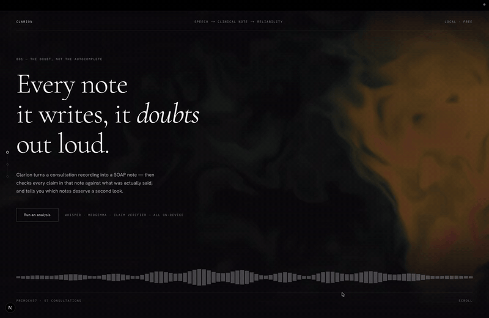

# Clarion — a reliability flag for AI-generated clinical notes

> Turn a doctor–patient consultation into a structured clinical note — then **check every claim in that note against what was actually said, and flag the notes that can't be trusted.**

An AI can turn a consultation recording into a tidy SOAP note. But a *fluent* note isn't necessarily a *faithful* one: it can state things that were never said (**hallucinations**) or quietly drop things that were (**omissions**) — both dangerous in medicine. Clarion is a local, free pipeline that writes the note **and grades its own trustworthiness**, turning the result into a traffic-light verdict: 🟢 reliable · 🟡 review · 🔴 unreliable.

**The reliability flag is the research contribution. The app is the stage it runs on.**

<!-- Demo GIF goes here once recorded (task 2). Placeholder path: -->


*Everything runs 100% locally and free — no cloud, no API keys. The audio never leaves the machine.*

---

## The headline result

The central question: **can an automatic score flag unreliable notes better than the standard text-similarity metrics?** Clarion validates this against PriMock57's clinician error ratings, under a locked pre-registration with the held-out test **scored exactly once**.

On the held-out **TEST** set (machine-written notes, n = 188 notes across 47 consultations), ranked by agreement with clinician error counts (Spearman ρ, 95% CI from a cluster bootstrap over whole consultations):

| Rank | Signal | TEST ρ [95% CI] | DEV ρ |
|---|---|---|---|
| 🥇 | **Claim-verifier (this project)** | **0.26 [0.08, 0.42]** | 0.67 |
| 2 | Levenshtein | 0.25 [0.08, 0.40] | 0.25 |
| 3 | LLM judge (Selene-Mini) | 0.20 [0.05, 0.34] | 0.03 |
| 4 | SummaC | 0.19 [0.01, 0.36] | −0.11 |
| 5 | ROUGE-L | 0.13 [−0.06, 0.33] | 0.30 |
| 6 | **BERTScore** | **0.06 [−0.12, 0.23]** | 0.56 |

**BERTScore looked best in development (0.56) and then collapsed on unseen data (0.06)** — its dev strength was leverage from one easy outlier. The source-grounded **claim-verifier was the most robust signal**, reaching ~48% of the human agreement ceiling, and it's the **only signal that works without a reference note** — i.e. the only one usable in real deployment, where there's no "correct" note to compare against.

The point isn't "my method wins everything" (no signal statistically dominates — the confidence intervals overlap). The point is that **pre-registration discipline is what exposed BERTScore's non-generalisation.** Measuring honestly beat measuring optimistically.

---

## How it works

Four stages, one Python library, all local:

```
  audio  ──▶  Whisper large-v3-turbo  ──▶  transcript
             transcript  ──▶  MedGemma-4B  ──▶  SOAP note
  note + transcript  ──▶  claim-verifier (Llama-3.1-8B)  ──▶  unsupported + omitted counts
             counts  ──▶  reliability flagger  ──▶  🟢 reliable / 🟡 review / 🔴 unreliable
```

A deliberate rule underpins the checker: **the verifier is a different model family from the generator**, so the model grading the note never grades its own writing. The verifier checks each claim in the note against the transcript, *and* separately lists what the note left out — because in clinical notes, the omissions are the more common failure.

The whole thing is exposed through one UI-agnostic entry point (`s2n.service.run_pipeline`) that takes audio *or* a transcript and returns plain JSON.

### The models (all local via Ollama, ≤8 GB total)

| Role | Model | In the product? |
|---|---|---|
| Transcribe | Whisper large-v3-turbo | ✅ |
| Generate the note | MedGemma-4B | ✅ |
| **Verify claims** ★ | Llama-3.1-8B (stock model, custom method) | ✅ |
| Judge (research baseline) | Atla Selene-Mini | ❌ reproduction only |

---

## Beyond the research: the product

The research would be a notebook. Clarion wraps it in a real, operable system:

- **Streaming web app** — FastAPI + Next.js 15, showing each stage live over SSE as it runs.
- **Audit trail** — every run is persisted (SQLite) with the exact models and prompt versions that produced it, so any verdict is fully reproducible after the fact.
- **Reviewer dashboard** at `/audit` — browse past runs, inspect verdicts, filter and drill in.
- **Observability** — request-id tracing end to end, plus per-stage latency metrics (`/api/metrics`).
- **One-command packaging** — `make run`, or a Docker image that talks to Ollama on the host.

---

## Quick start

You don't need to read the code to run it. One file installs what's missing, downloads the models (~8 GB, first run only), and opens the app.

**Mac:** double-click `setup_mac.command` (or `./setup_mac.command` in a terminal), then open **http://localhost:3000**.

**Windows:** double-click `SETUP_WINDOWS.bat`, leave the "Ollama Engine" window open, then open **http://localhost:3000**.

For running it as a service, the Docker image, and full troubleshooting, see **[DEPLOY.md](DEPLOY.md)**. To reproduce the research pipeline end to end, see [Reproducing the research](#reproducing-the-research) below.

---

## What it's honest about (limitations)

Good engineering names its own blind spots. Clarion's:

- **It catches fabrications well but misses ~two-thirds of omissions** — the single biggest weakness, and quantified rather than hidden.
- **Verdict thresholds are population-specific** and must be recalibrated per deployment.
- A **near-empty note can look "faithful"** — the flag needs a length/coverage guard.
- It measures **faithfulness, not relevance** — it won't reject off-topic audio (no "is this even a consultation?" gate).
- **Individual flags can be wrong**; only the note-level *count* is validated.
- Validated on **one primary dataset** (PriMock57) — generalisation to other data/accents is unproven.

None of these are dealbreakers for a flag whose job is to say "a human should look at this one." They're the roadmap.

---

## Tech stack

**Python** (library + 12 numbered, reproducible pipelines) · **FastAPI** + Server-Sent Events · **Next.js 15 / TypeScript / Tailwind** · **Ollama** (local inference) · **SQLite** (audit trail) · **Docker**. Config-driven throughout; versioned prompts; data-leakage prevented structurally and enforced by an automated test. 144 passing tests.

### Repo layout

```
src/s2n/            the engine (UI-agnostic library)
  transcription/      Whisper wrapper + WER
  generation/         transcript + prompt → note
  evaluation/         metrics + LLM-judge + claim-verifier  ← the research
  reliability/        counts → verdict (the flag)           ← the star
  llm/                backend-agnostic model client
prompts/            versioned prompts (v1.0, v1.1 …)
pipelines/          runnable research stages (00 → 12)
app/api/            FastAPI + SSE
app/web/            Next.js front end (Clarion) + /audit dashboard
config/config.yaml  one control panel — every setting lives here
tests/              unit tests incl. the leak-safety firewall
docs/               architecture + decision records
```

---

## Reproducing the research

Every stage is a standalone script in `pipelines/`, run in order with Ollama up (`medgemma:4b`, `llama3.1:8b`, `atla/selene-mini`). All settings come from `config/config.yaml`.

```bash
python pipelines/00_dataset_report.py     # dataset inventory + integrity
python pipelines/01_transcribe.py         # Whisper over the audio
python pipelines/02_generate_notes.py     # transcripts → SOAP notes
python pipelines/03_evaluate.py           # metrics + judge + reliability
# … pipelines 03a–08 : endpoint selection, validity gates, the RQ1 harness,
#     judge versions, and the locked claim-verifier
python pipelines/11_test_oneshot.py       # the one-shot held-out TEST (already spent)
```

⚠ **The held-out TEST split is scored exactly once** (pre-registration) and **has already been run.** The harness refuses to re-score it. Committed test results are scores-only; full artefacts stay local because they embed transcripts and gold notes.

Data used: **PriMock57** (57 mock GP consultations + 285 clinician-rated notes — the answer key), a **self-built synthetic set** (43 consultations with *known* planted errors, evaluation-only), and **MTS-Dialog** (fine-tuning experiment only).

---

## Where this came from

Clarion began as a solo MSc module project (ECS-8060, Queen's University Belfast) — built under a locked research protocol and a fixed deadline, submitted and defended in a live viva in August 2026. Everything since is independent development toward a genuinely useful system. The full record of what was academic and what came after — including the research protocol, every major decision, and the results in detail — lives in **[CHECKPOINT.md](CHECKPOINT.md)**.

**Author:** Trupal Chauhan
